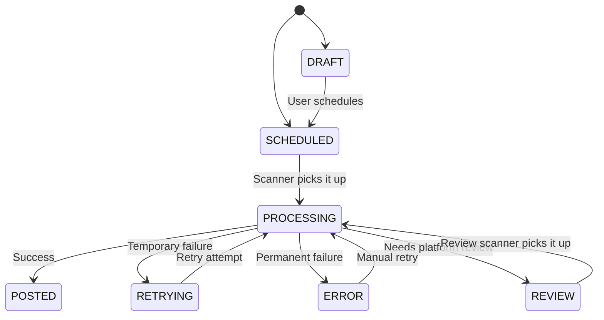

So you want to build a scheduler? You want to be the next Buffer or Hootsuite?

Cool. Here is how you actually do it with bundle.social. Not the "hello world" version - the real thing, with error handling, retries, drafts, and all the edge cases that will bite you at 2 AM.

---

## The Architecture

The high-level flow is simple. The devil is in the details (which we cover below).

1. **User connects account** (via [Connect Flow](/api-reference/connect-social-accounts)).
2. **User uploads content** (via [Media Upload](/api-reference/upload-content)).
3. **User picks a date** (your UI).
4. **You send it to us** (API call).
5. **We publish it** (our infrastructure).
6. **We tell you what happened** ([Webhooks](/api-reference/webhooks)).

Simple? In theory. Let's go deeper.

---

## Post Status Lifecycle

This is the most important thing to understand. A post is not just "scheduled" or "published". It goes through a state machine.



### Status Breakdown

| Status | What It Means | What You Should Show |
| :--- | :--- | :--- |
| `DRAFT` | Saved but not scheduled. No `postDate` set (or set in the past). | "Draft" - editable, not going anywhere yet. |
| `SCHEDULED` | Has a future `postDate`. Waiting in line. | "Scheduled for Dec 25 at 10:00 AM" |
| `PROCESSING` | We picked it up and are actively publishing it. | "Publishing..." - spinner time. |
| `POSTED` | Successfully published to the platform. | "Published" - show the permalink. |
| `RETRYING` | Failed, but we're going to try again. | "Retrying..." - don't panic yet. |
| `ERROR` | Failed after all retries. Dead. | "Failed" - show the error, offer manual retry. |
| `REVIEW` | Platform needs to review it (mostly TikTok). | "Under Review" - patience. |

### Retry Logic

When a post fails to publish, we don't give up immediately:

- **Max retries:** 3 attempts
- **Backoff:** Exponential, starting at 3 minutes
- **Between retries:** Status is set to `RETRYING`
- **After all retries exhausted:** Status becomes `ERROR`

If the error is a "review" error (common with TikTok), the post goes to `REVIEW` instead. We periodically re-check and re-attempt publishing.

<Note>
**Manual retry:** Users can retry `ERROR` posts via the API. This resets the retry counter and re-queues the post. Max 3 manual retries total - we don't want infinite loops (we've seen things).
</Note>

---

## Step 1: Connect Accounts

Before you can schedule anything, the user needs to connect their social accounts. See the [Connect Flow](/api-reference/connect-social-accounts) guide for the full walkthrough.

Quick version: you redirect the user to our OAuth flow, they authorize, we give you a `socialAccountId`. Done.

---

## Step 2: Import History (Optional but Recommended)

Don't show an empty calendar. Nobody likes staring at a blank grid wondering if the app is broken.

Use the [Post History Import](/api-reference/import-posts) to fetch their recent posts and populate the calendar.

```typescript
await bundlesocial.postHistoryImport.create({
  teamId: 'team_abc',
  socialAccountType: 'INSTAGRAM',
  count: 50,
  withAnalytics: true,
});
```

<Warning>
**Imported posts are deleted after 30 days.** They're meant to populate your UI, not serve as a permanent archive. If you need them long-term, save them and don't let them go. See [Data Retention](/api-reference/data-retention).
</Warning>

---

## Step 3: Upload Media

**Crucial:** Upload media *before* the user hits "Schedule". You need the `uploadId` to create the post.

- **Simple Upload** - for images and small files. One request, done.
- **Resumable Upload** - for videos. Three steps (init, push bytes, finalize), but if the upload fails at 99%, you don't start over.

See [Media Upload](/api-reference/upload-content) for the full guide.

```typescript
// Simple upload example
const upload = await bundlesocial.upload.create({
  teamId: 'team_abc',
  file: myImageFile,
});
const uploadId = upload.id; // e.g. "upload_123"
```

<Info>
**Pro tip:** Always use Resumable Upload for videos. If a 500MB upload fails with Simple Upload, your user has to start over. With Resumable, they don't. Your users will thank you. Your support inbox will thank you.
</Info>

---

## Step 4: Create the Post

Here's where it gets interesting. You can create a post as a **draft** or **schedule it immediately**.

### Schedule for the Future

```typescript
const post = await bundlesocial.post.create({
  teamId: 'team_abc',
  socialAccountIds: ['instagram_123', 'tiktok_456'],
  text: "Launching something big tomorrow. Stay tuned.",
  uploadIds: ['upload_789'],

  // THE IMPORTANT PART
  postDate: "2026-12-25T10:00:00.000Z", // UTC ISO string

  // Platform-specific options
  data: {
    INSTAGRAM: {
      type: "REEL"
    },
    TIKTOK: {
      privacyLevel: "PUBLIC_TO_EVERYONE",
      allowComment: true,
      allowDuet: true,
      allowStitch: true,
    }
  },

  // First comment for hashtags (keeps the caption clean)
  comments: [
    {
      text: "#launch #product #exciting",
      socialAccountIds: ['instagram_123']
    }
  ]
});
```

<Warning>
**Timezones matter.** Always send `postDate` in **UTC**. If your user is in Tokyo and picks "10:00 AM", convert that to UTC before sending it to us. If you don't, they'll be posting at 3 AM Tokyo time and blaming you. And then they'll blame us. And then we'll blame you again.
</Warning>

### Save as Draft

Don't set `postDate`, or set the status to `DRAFT`:

```typescript
const draft = await bundlesocial.post.create({
  teamId: 'team_abc',
  socialAccountIds: ['instagram_123'],
  text: "Work in progress...",
  uploadIds: ['upload_789'],
  // No postDate = draft
});
```

The user can come back later, edit it, and schedule it when ready.

### Platform-Specific Data Options

Each platform has its own special fields in the `data` object. Here are the highlights:

| Platform | Key Options |
| :--- | :--- |
| **Instagram** | `type` (`REEL`, `STORY`, `POST`), `coverUrl`, `locationId` |
| **TikTok** | `privacyLevel`, `allowComment`, `allowDuet`, `allowStitch`, `autoAddMusic` |
| **YouTube** | `title` (required), `privacyStatus`, `madeForKids` (required, legal!), `categoryId` |
| **Facebook** | `type` (`REEL`, `STORY`, `POST`) |
| **LinkedIn** | `visibility` |
| **Pinterest** | `boardId` (required - you can't pin to thin air), `title`, `link` |
| **Reddit** | `subredditName` (required), `title` (required), `flairId` |
| **Discord** | `channelId` (required), `username`, `avatarUrl` |
| **Slack** | `channelId` (required), `username`, `avatarUrl` |
| **Google Business** | `topicType`, `callToActionType`, `callToActionUrl`, event/offer fields |

Check each [platform's page](/api-reference/platforms/index) for the full list of options and their constraints.

---

## Step 5: Edit or Cancel

### Update a Scheduled Post

Only `DRAFT` and `SCHEDULED` posts can be updated. Once a post is `PROCESSING` or beyond, it's too late.

```typescript
await bundlesocial.post.update({
  postId: 'post_abc',
  text: "Updated copy. Much better.",
  postDate: "2026-12-26T10:00:00.000Z", // Reschedule
});
```

### Delete a Scheduled Post

Soft-deletes the post. Sets status to `DELETED`.

```typescript
await bundlesocial.post.delete({
  postId: 'post_abc',
});
```

If the post was already `POSTED`, this only deletes it from our system - it does NOT remove it from the social platform. We can't un-ring that bell.

---

## Step 6: Handle the Results

Scheduling is **asynchronous**. You send us the post, we queue it, and you find out later what happened. There are two ways to know:

### Option A: Webhooks (Recommended)

Set up a [webhook endpoint](/api-reference/webhooks) and listen for:

| Event | Meaning | What To Do |
| :--- | :--- | :--- |
| `post.published` | Post is live | Update UI to "Published". Show permalink. |
| `post.failed` | Post failed after all retries | Show error to user. Offer manual retry. |
| `comment.published` | First comment posted | Update UI if you show comment status. |

```typescript
// Your webhook handler
app.post('/webhooks/bundle', (req, res) => {
  const event = req.body;

  switch (event.type) {
    case 'post.published':
      await updatePostStatus(event.data.postId, 'published');
      break;
    case 'post.failed':
      await updatePostStatus(event.data.postId, 'failed');
      await notifyUser(event.data.postId, event.data.error);
      break;
  }

  res.status(200).send('OK');
});
```

<Note>
**Verify webhook signatures.** Don't trust random POST requests. We sign every webhook with HMAC SHA256. See [Webhooks](/api-reference/webhooks) for the verification code.
</Note>

### Option B: Polling

If you can't use webhooks, you can poll the post status:

```typescript
const post = await bundlesocial.post.get({ postId: 'post_abc' });

if (post.status === 'POSTED') {
  // Show success
} else if (post.status === 'ERROR') {
  // Show error details in post.error
} else if (post.status === 'REVIEW') {
  // Tell user: "Platform is reviewing your post"
}
```

Don't poll every 100ms. Once every 30-60 seconds is fine. You won't miss anything by being patient.

### Error Notifications

If you set `sendEmailOnError: true` when creating a post, we'll email the user when their post fails. One less thing for you to build.

---

## Bulk Scheduling

Want to schedule 50 posts at once? Go for it. But be smart about it.

### Rate Limits

- **API rate limits:** Multi-layer limits per endpoint and tracker (API key / bearer token / IP fallback): burst `100/1s`, short `500/10s`, minute `2000/60s`. See [Rate Limits](/api-reference/rate-limits).
- **Platform limits:** Each platform has its own daily posting limits per team. Check our [Platform Limits](/api-reference/limits#daily-posting-limits-per-platform) for the exact numbers per tier. If you blast 50 TikToks in an hour, TikTok might have opinions.

### Best Approach

```typescript
// Space them out. Don't schedule everything for the same second.
const posts = contentCalendar.map((item, index) => ({
  teamId: 'team_abc',
  socialAccountIds: item.accounts,
  text: item.text,
  uploadIds: item.uploads,
  postDate: addMinutes(item.date, index * 5), // 5-minute gaps
}));

for (const post of posts) {
  await bundlesocial.post.create(post);
}
```

---

## Best Practices

### 1. Validate Before Scheduling

Don't let a user schedule a 10-minute video for an Instagram Story. It will fail. At 3 AM. On Christmas. And they will email you.

Check our [Platform Limits](/api-reference/limits) and validate in your UI before sending anything to us. We validate too, but catching errors early is better for everyone.

### 2. Timezones. Seriously.

We accept `postDate` in **UTC only**. Convert on your end. Every timezone bug in social media scheduling comes from someone who thought "eh, it's probably fine" and didn't convert.

### 3. First Comment Strategy

Use the `comments` array to put hashtags in the first comment instead of the caption. It keeps the post clean and looks more professional.

```typescript
comments: [
  {
    text: "#growth #mindset #grind #blessed",
    socialAccountIds: ['instagram_123']
  }
]
```

Instagram's algorithm treats first-comment hashtags the same as caption hashtags. Your users' feeds will look better.

### 4. Remember Data Retention

- **Imported posts:** Deleted after 30 days. Store them if you need them.
- **Analytics:** Deleted after 30 days. Fetch daily if you're building reports.
- **Webhook events:** Deleted after 7 days. Log them on your end.

See [Data Retention](/api-reference/data-retention) for the full breakdown.

### 5. Handle the REVIEW Status

TikTok (and occasionally other platforms) may put posts into a review state instead of publishing immediately. This is normal. Don't show it as an error - show it as "Under Review" and let us handle it. We periodically re-check and re-attempt publishing.

### 6. Don't Forget `madeForKids` on YouTube

This is a **legal requirement** (COPPA). If the content targets children, you must set `madeForKids: true`. If you don't, YouTube will eventually notice, and penalties apply. We expose this field - use it.
